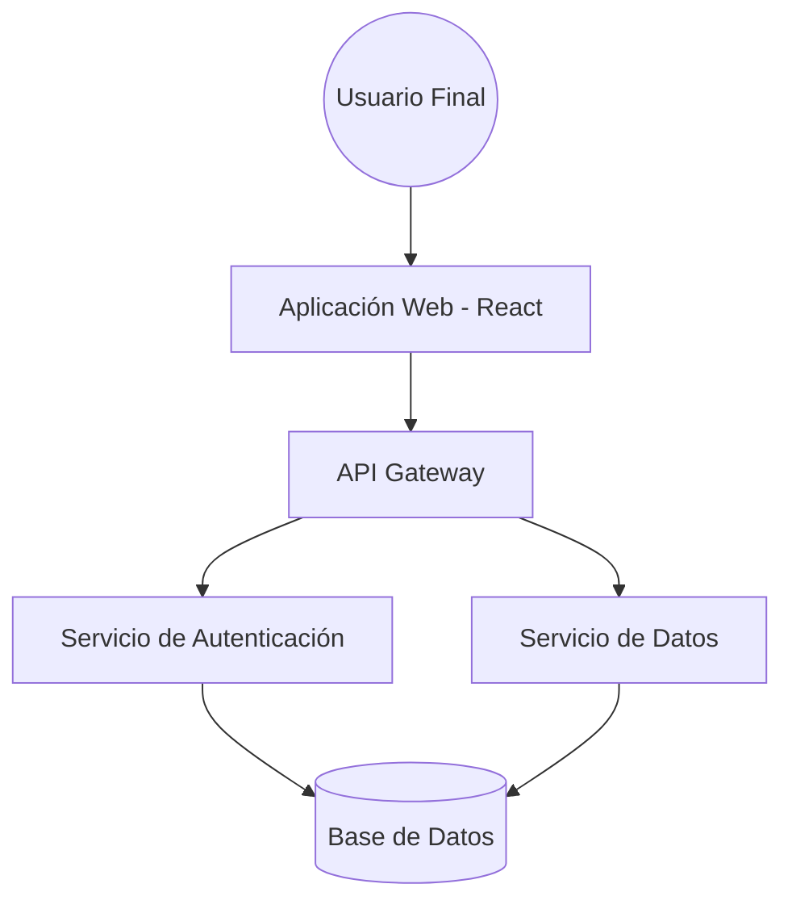

# Diseño de la Arquitectura del Sistema

## 1. Descripción General
El sistema utiliza una arquitectura de **Microservicios** para garantizar la escalabilidad y el mantenimiento independiente de cada módulo.

## 2. Diagrama de Arquitectura (C4 Model - Level 1)

## 3. Tecnologías Propuestas
- Frontend: React / Next.js
- Backend: Node.js con NestJS
- Infraestructura: AWS (EC2, RDS)
- Base de Datos: PostgreSQL